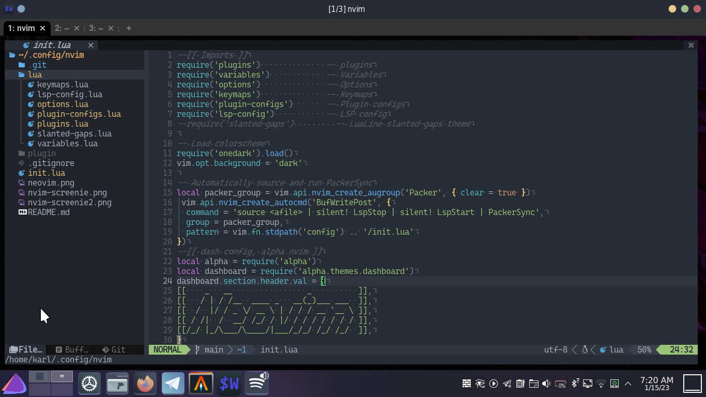

# NVIM Configs
All new, ALL LUA, lean and mean NVIM configs, by yours truly. Enjoy.

## Screenshot, COQ, LSP rocking it!
Here is a screenshot running my nvim config with a completely transparent background, 
showing off a kitty terminal with custom EOS graphic in the bottom left corner, desktop 
is running Plasma.

Here is another in Plasma, this time with an alacritty terminal, matching tokyonight color 
scheme is producing a beautiful semi-transparent colorscheme for nvim. This is one of my 
favorites!

