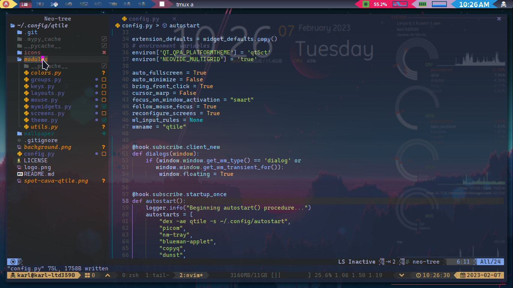
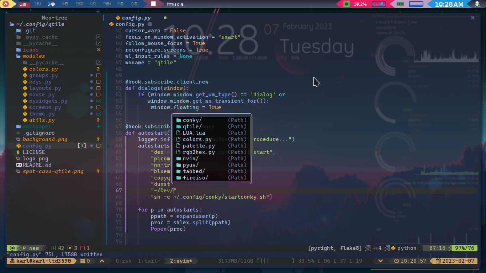

# linuxkarl's Neovim dotfiles
Well folks, here's my latest and greatest neovim configuration (which is 
ALWAYS a work in progress). I am what you might call a dot-junkie; 
someone who is never satisfied with their config and is constantly 
searching for that perfect setup (that they will no-doubt never find). 
However, let me brag on myself after that admission and say that 
I tend to come extremely close to the perfect setup when I set my 
mind to it.

## Screenshots
Here are a few screenshots for you unixporn lovers like me!

Aother...

## Thanks for visiting
Thank you for visiting my little haven and taking your valuable time 
to check out my idiotic search for the unattainable!

Contact
-------
* kmhnashville@gmail.com
* @linuxkarl on telegram
* linuxkarl on irc
